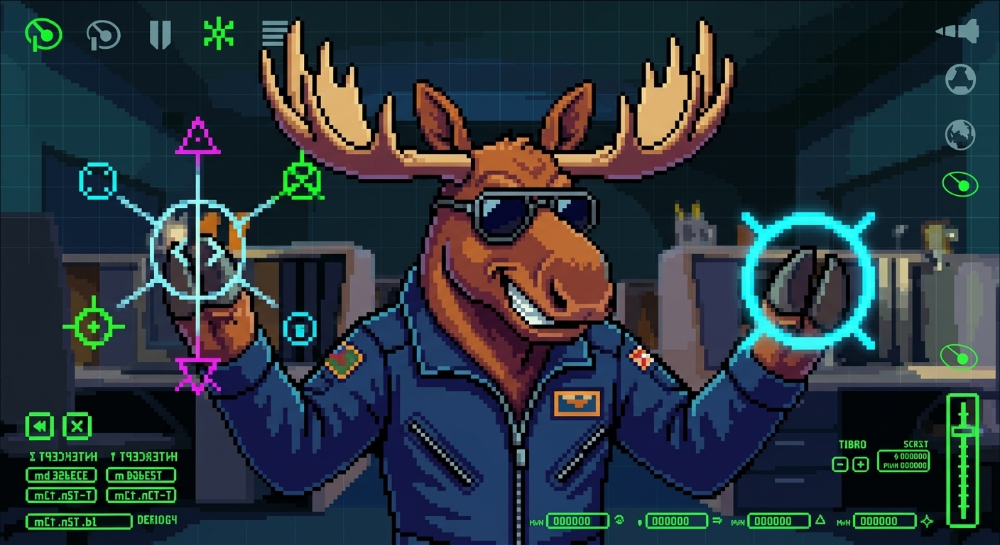

# ELK - Extended Logic Keys



A small KSP plugin that assigns configurable keyboard hotkeys to stock functions that don't have any: toggling *Brakes*, or setting a specific SAS autopilot mode (Stability Assist, Prograde/Retrograde, Normal/Anti-normal, Radial in/out, Target/Anti-target, Maneuver node). An optional in-game toolbar (Space Center only) lets you assign keys by pressing them, instead of hand-editing a config file.

## The problem

Stock KSP has no way to:
- **Toggle** Brakes from the keyboard - `B` only holds them while pressed, there's no "parking brake" key (a [long-standing request](https://forum.kerbalspaceprogram.com/topic/180598-a-shortcut-to-lock-brakes/) that never got picked up).
- Jump straight to a specific **SAS mode** (Retrograde, Radial, a maneuver node...) with one press. `T` only toggles SAS on/off in whatever mode it was last in; picking a mode means clicking the navball.

## How it works

Each hotkey just calls the same stock API the UI itself uses. Since it drives the real stock state, the flight UI (status light, navball SAS indicator), the right-click PAW, and any other mod reading that same state all stay in sync automatically.

## Installation

Drop the `ELK` folder into `GameData`, so you end up with `GameData/ELK/Plugins/ELK.dll`. The optional toolbar additionally needs [ToolbarControl](https://github.com/linuxgurugamer/ToolbarControl) and [ClickThroughBlocker](https://github.com/linuxgurugamer/ClickThroughBlocker), both bundled in the release zip.
Set `toolbar = false` in the cfg (see below) if you'd rather not have them at all and just hand-edit the config.

## Configuration

`PluginData/ELK.cfg` - re-read every time you enter Flight or the Space Center (no restart needed):

```
ELK
{
	enabled = true
	toolbar = true

	BRAKES_TOGGLE
	{
		key =
	}
	SAS_STABILITY
	{
		key =
	}
	SAS_PROGRADE
	{
		key =
	}
	SAS_RETROGRADE
	{
		key =
	}
	SAS_NORMAL
	{
		key =
	}
	SAS_ANTINORMAL
	{
		key =
	}
	SAS_RADIAL_IN
	{
		key =
	}
	SAS_RADIAL_OUT
	{
		key =
	}
	SAS_TARGET
	{
		key =
	}
	SAS_ANTITARGET
	{
		key =
	}
	SAS_MANEUVER
	{
		key =
	}
}
```

Every `key` ships **empty**. This is deliberate: ELK never picks a default for you, so a fresh install can never collide with a binding you already use elsewhere. 

**Key format**: optional modifiers separated by `+`, then the main key, all literal `UnityEngine.KeyCode` names - e.g. `Y`, `LeftAlt+Y`, `LeftControl+LeftShift+G`. A key captured through the toolbar is written back in this exact format, so both ways of setting a key stay compatible with each other.

### Toolbar

Space Center scene only: ELK's hotkeys are global player bindings with nothing vessel, part, or flight-specific about them, so the button doesn't clutter Flight/VAB/SPH/Tracking Station. Click **Capture** next to a function, then press the key (or combo) you want: it will be bound the instant you press it. **Clear** removes a binding, so does pressing <kbd>Delete</kbd> while a capture is in progress. <kbd>Esc</kbd> cancels a capture without changing anything. A non-blocking warning appears under a row if the key you just picked is also used by another ELK slot or by a stock keybinding (see below for why that warning matters). It's advisory only, you can keep it if you want.

### Presets

A "preset" is just an `ELK.cfg` file with keys already filled in. You can find a selection of them here. Anyone can put one together and share it (a gist, a forum post, a zip - whatever). To use one, close KSP, replace `GameData/ELK/PluginData/ELK.cfg` with the one you got, and relaunch.

## Why not bind Brakes to `B`

**Don't use whatever key is currently bound to the stock *Brakes* action** (`Settings > Input > BRAKES`, `B` by default) as `BRAKES_TOGGLE`'s key, not even with a modifier. Any combo containing `B` can only ever *disengage* the brakes, never re-engage them. A key with no stock binding at all sidesteps the conflict entirely. The toolbar's conflict warning checks every stock `GameSettings` keybinding (via reflection) and would flag this collision live.

## Compatibility

Built and tested against KSP 1.12.5. No other mod dependency for the core hotkeys. The toolbar needs ToolbarControl/ClickThroughBlocker.

## Contributing

Want to propose a new hotkey slot? See [CONTRIBUTING.md](CONTRIBUTING.md).

## Predecessor

The brake toggle here started as its own small mod, [KSP-Stock-Brake-Toggle](https://github.com/Rjoande/KSP-Stock-Brake-Toggle) (now archived in favor of ELK). SAS hotkeys are a fresh implementation, not a fork of the decade-old, GPL-3.0, [SASHotkeys](https://github.com/petersohn/SASHotkeys) (different license, different external dependency, and the stock API it targeted has since gained a `CanSetMode` guard this version relies on).

## License

MIT - see [LICENSE](LICENSE).

## Credits

Author: Rjoande. Built with the help of Claude Code.
